# Data visualization

## Introduction


```r
library(tidyverse)
library(gridExtra)
library(maps)
library(mapproj)
```

## First steps
### Exercise
1. Run `ggplot(data = mpg)`. What do you see? An empty plot with a background constructed by ggplot.

```r
ggplot(data = mpg)
```


### Exercise
2. How many rows and columns are in mtcars?

```r
data(mtcars)
dim(mtcars)
#> [1] 32 11
```

### Exercise
3. What does the drv variable describe? f = front-wheel drive, r = rear wheel drive, 4 = 4wd

```r
?mpg
```

### Exercise
4. Make a scatter-plot of hwy versus cyl.

```r
ggplot(aes(x = cyl, y = hwy), data = mpg) +
  geom_point()
```


### Exercise
5. What happens if you make a scatter-plot of class versus drv? Why is the plot not useful? It just displays which class a particular drv falls under, or the reverse. *Vertical axis against/versus Horizontal axis.*

```r
ggplot(aes(x = drv, y = class), data = mpg) +
  geom_point()
```


## Aesthetic mappings
### Exercise
1. What's gone wrong with this code? Why are the points not blue? Because color is inside the aesthetic wrapper.

```r
ggplot(data = mpg) +
  geom_point(aes(x = displ, y = hwy, color = 'blue'))
```


### Exercise
2. Which variables in mpg are categorical? Which variables are continuous? How can you see this information when you run mpg?
**Categorical:**  manufacturer, model, trans, drv, fl, class.
**Continuous:**   displ, year, cyl, cty, hwy
Review the labels under the column headers when looking for the type of variable.

```r
glimpse(mpg)
#> Observations: 234
#> Variables: 11
#> $ manufacturer <chr> "audi", "audi", "audi", "audi", "audi", "audi", "...
#> $ model        <chr> "a4", "a4", "a4", "a4", "a4", "a4", "a4", "a4 qua...
#> $ displ        <dbl> 1.8, 1.8, 2.0, 2.0, 2.8, 2.8, 3.1, 1.8, 1.8, 2.0,...
#> $ year         <int> 1999, 1999, 2008, 2008, 1999, 1999, 2008, 1999, 1...
#> $ cyl          <int> 4, 4, 4, 4, 6, 6, 6, 4, 4, 4, 4, 6, 6, 6, 6, 6, 6...
#> $ trans        <chr> "auto(l5)", "manual(m5)", "manual(m6)", "auto(av)...
#> $ drv          <chr> "f", "f", "f", "f", "f", "f", "f", "4", "4", "4",...
#> $ cty          <int> 18, 21, 20, 21, 16, 18, 18, 18, 16, 20, 19, 15, 1...
#> $ hwy          <int> 29, 29, 31, 30, 26, 26, 27, 26, 25, 28, 27, 25, 2...
#> $ fl           <chr> "p", "p", "p", "p", "p", "p", "p", "p", "p", "p",...
#> $ class        <chr> "compact", "compact", "compact", "compact", "comp...
```

### Exercise
3. Map a continuous variable to color, size, and shape. How do these aesthetics behave differently for categorical versus continuous variables? Categorical variables are assigned distinct colors. Continuous variables are assigned 'scaling' colors. In other words, a color that slides between a spectrum, aiding to the continuous nature of the variable. With shapes, continuous variables cannot be assigned. `ggplot` kicks back an error.

```r
glimpse(mpg)
#> Observations: 234
#> Variables: 11
#> $ manufacturer <chr> "audi", "audi", "audi", "audi", "audi", "audi", "...
#> $ model        <chr> "a4", "a4", "a4", "a4", "a4", "a4", "a4", "a4 qua...
#> $ displ        <dbl> 1.8, 1.8, 2.0, 2.0, 2.8, 2.8, 3.1, 1.8, 1.8, 2.0,...
#> $ year         <int> 1999, 1999, 2008, 2008, 1999, 1999, 2008, 1999, 1...
#> $ cyl          <int> 4, 4, 4, 4, 6, 6, 6, 4, 4, 4, 4, 6, 6, 6, 6, 6, 6...
#> $ trans        <chr> "auto(l5)", "manual(m5)", "manual(m6)", "auto(av)...
#> $ drv          <chr> "f", "f", "f", "f", "f", "f", "f", "4", "4", "4",...
#> $ cty          <int> 18, 21, 20, 21, 16, 18, 18, 18, 16, 20, 19, 15, 1...
#> $ hwy          <int> 29, 29, 31, 30, 26, 26, 27, 26, 25, 28, 27, 25, 2...
#> $ fl           <chr> "p", "p", "p", "p", "p", "p", "p", "p", "p", "p",...
#> $ class        <chr> "compact", "compact", "compact", "compact", "comp...
ggplot(aes(x = displ, y = hwy),
       data = mpg) +
  geom_point(aes(color = model))

ggplot(aes(x = displ, y = hwy),
       data = mpg) +
  geom_point(aes(color = cty))
```

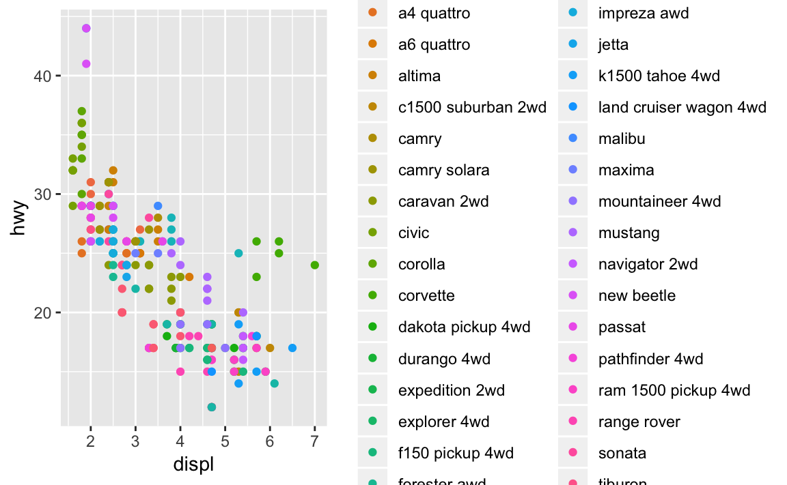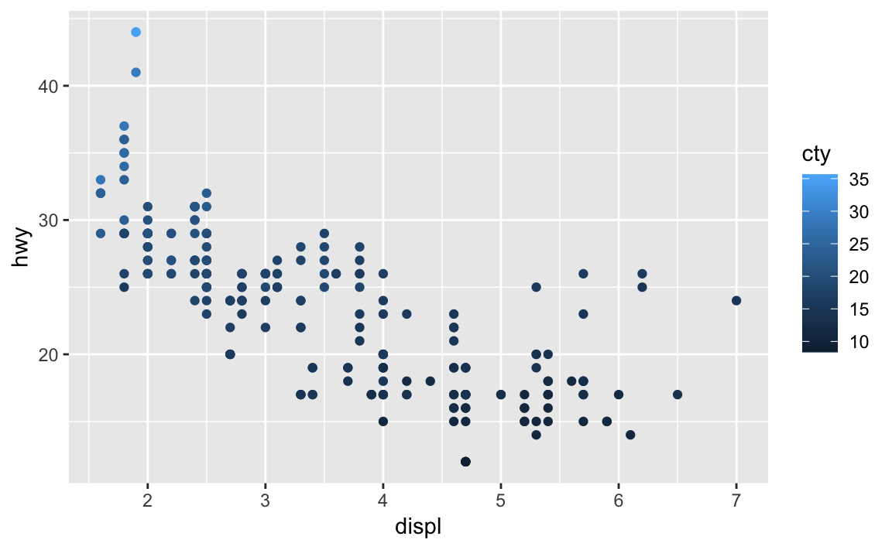

### Exercise
4. What happens if you map the same variable to multiple aesthetics? It seems to map all the aesthetics specified.

```r
ggplot(aes(x = displ, y = hwy),
       data = mpg) +
  geom_point(aes(color = manufacturer, shape = manufacturer, size = manufacturer))
#> Warning: Using size for a discrete variable is not advised.
#> Warning: The shape palette can deal with a maximum of 6 discrete values
#> because more than 6 becomes difficult to discriminate; you have
#> 15. Consider specifying shapes manually if you must have them.
#> Warning: Removed 112 rows containing missing values (geom_point).
```

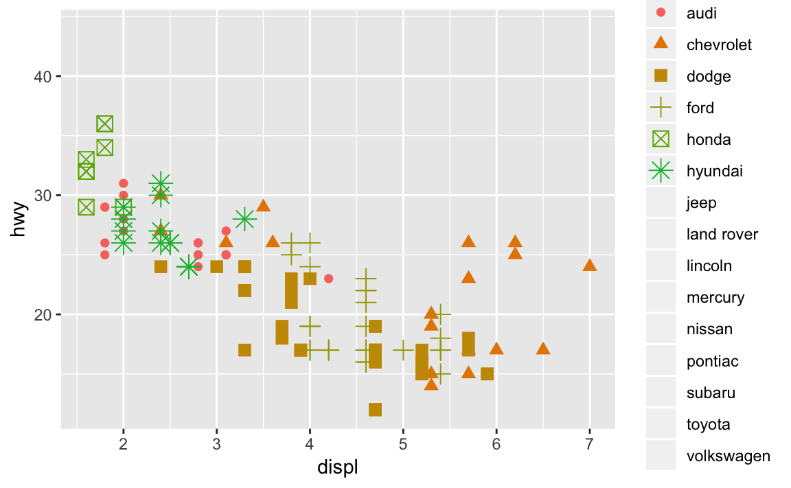

### Exercise
5. What does the strike aesthetic do? What shapes does it work with? (Hint: use ?geom_point.) It modifies the width the border. It only works on shapes with borders (like 21). 

```r
?geom_point

ggplot(aes(x = displ, y = hwy),
       data = mpg) +
  geom_point(aes(color = cyl), shape = 21, fill = 'white', stroke = 1)
```

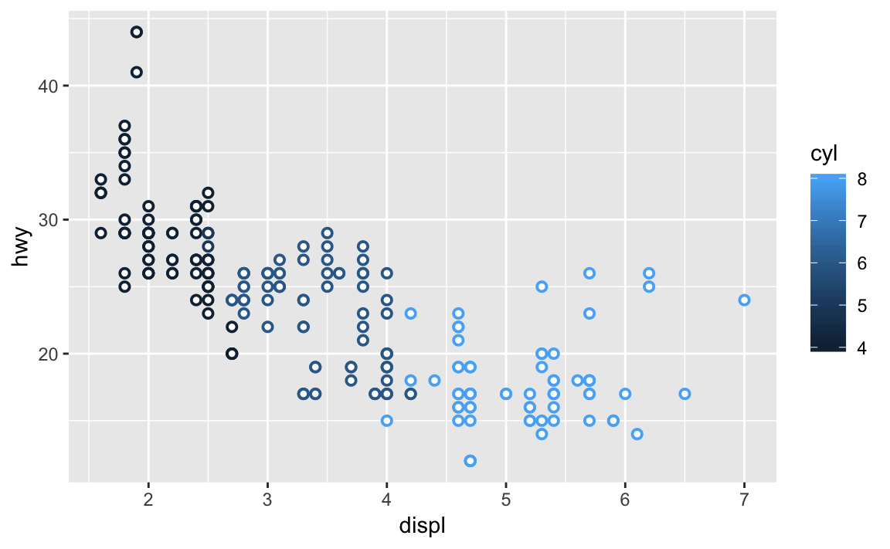

### Exercise
6. What happens if you map an aesthetic to something other than a variable name, like aes(color = displ < 5)? Ggplot performs the operation and charts the outcome. Note, if relational operators are used, booleans are graphed.

```r
ggplot(aes(x = displ + 5, y = hwy),
       data = mpg) +
  geom_point()
```


## Facets
### Exercise
1. What happens if you facet a continuous variable? It basically created separate plots sectioning off the continuous data point.

```r
ggplot(aes(x = displ, y = hwy), data = mpg) +
  geom_point(aes(x = displ, y = hwy)) +
  facet_wrap(~ cyl, nrow = 2)
```

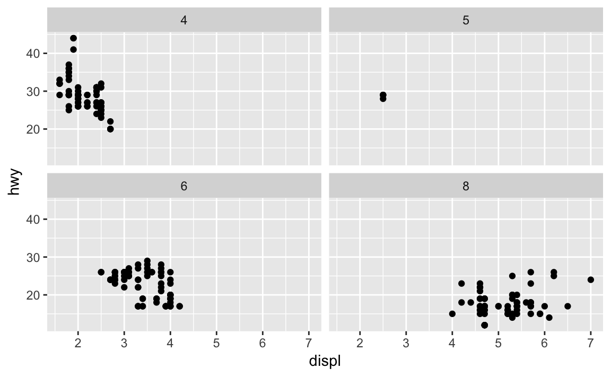

### Exercise
2. What do the empty cells in a plot with facet_grid(drv ~ cyl) mean? How do they relate to this plot? The empty plots indicate that there is not a data point where both values are TRUE or available. For example, there are no 4wd cars that are 5 cyl. The facet_grid also shows this as an empty plot. 

```r
ggplot(aes(x= drv, y = cyl), data = mpg) +
  geom_point()
```

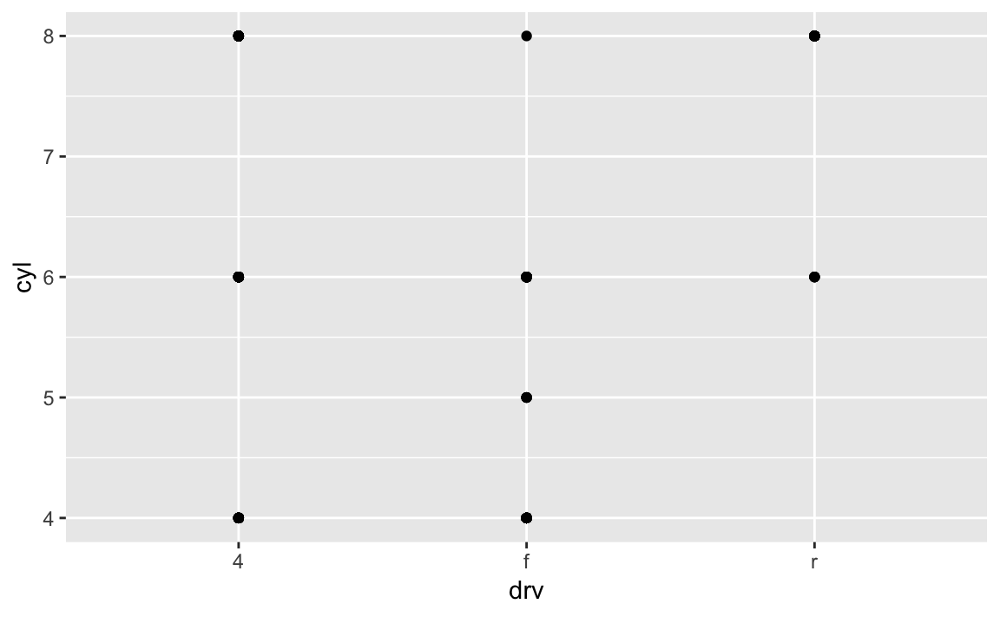

### Exercise
3. What plots does the follow code make? What does . do? They make facet plots. When . is included on the first graph, it allows for horizontal faceting. 

```r
ggplot(data = mpg) +
  geom_point(aes(x = displ, y = hwy)) +
  facet_grid(drv ~ .)
```


```r
ggplot(data = mpg) +
  geom_point(aes(x = displ, y = hwy)) +
  facet_grid(. ~ cyl)
```


### Exercise
4. Take the first faceted plot in this section:

```r
ggplot(data = mpg) +
  geom_point(aes(x = displ, y = hwy)) +
  facet_wrap(~ class, nrow = 2)
```

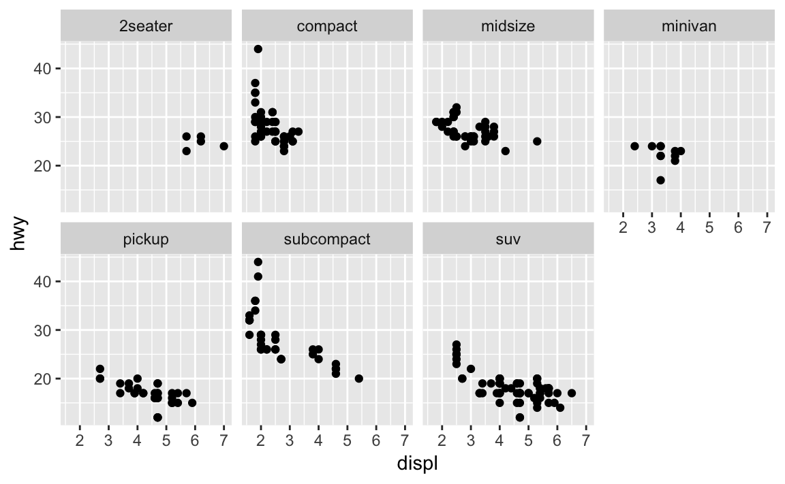

What are the advantages to using faceting instead of the color aesthetic? What are the disadvantages? How might the balance change if you had a larger data set?

**Advantages:**     faceting allows for an isolating view of the variables observed. In other words, it reduces the potential noise and increases the readability for a particular variable. 

**Disadvantages:**  on the other hand, using the color aesthetic is natural to the human eye, and immediately draws on pattern recognition. If data sets were too large (too wide), faceting would not work given the limitation of screen real estate.

### Exercise
5. Read `?facet_wrap`. What does nrow do? What does ncol do? What other options control the layout of the individual panels? Why doesn't facet_grid() have nrow and ncol variables? Nrow and ncol control the number of dimensions of a faceted visualization. Facet grid excludes nrow and ncol because it is specifically for two discrete variables. Therefore, the rows and columns must be divisible by two.

```r
?facet_wrap
```

Control the number of rows and columns with nrow and ncol

```r
ggplot(mpg, aes(displ, hwy)) +
  geom_point() +
  facet_wrap(~class, nrow = 4)
```


Facet by multiple variables

```r
ggplot(mpg, aes(displ, hwy)) +
  geom_point() +
  facet_wrap(~ cyl + drv)
```


Use the `labeller` option to control how labels are printed:

```r
ggplot(mpg, aes(displ, hwy)) +
  geom_point() +
  facet_wrap(c("cyl", "drv"), labeller = "label_both")
```

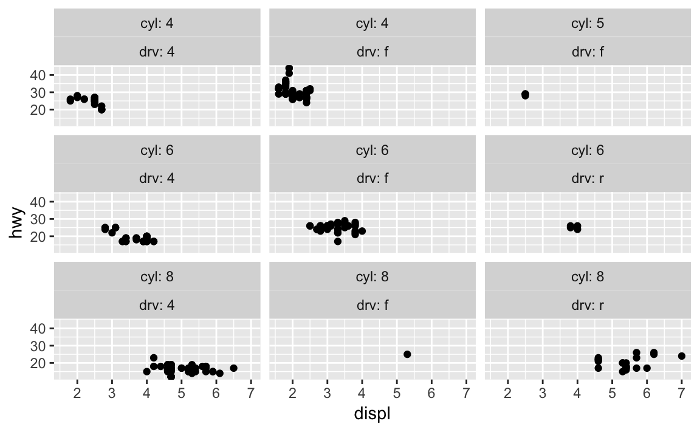

Free scales

```r
ggplot(mpg, aes(displ, hwy)) +
  geom_point() +
  facet_wrap(~class, scales = "free")
```


### Exercise
6. When using `facet_grid()` you should usually put the variable with more unique levels in the columns. Why? It is visually easier to compare across columns.

## Geometric Objects
You can set the linetype aesthetic to a particular variable

```r
ggplot(aes(x = displ, y = hwy), data = mpg) +
  geom_smooth(aes(linetype = drv))
#> `geom_smooth()` using method = 'loess' and formula 'y ~ x'
```


### Exercise
1. What geom would you use to draw a line chart? A boxplot? A histogram? An area chart?

```r
ggplot(aes(x = displ, y = hwy), data = mpg) +
  geom_line()
```


```r
ggplot(aes(x = drv, y = hwy), data = mpg) +
  geom_boxplot()
```


```r
ggplot(aes(x = displ), data = mpg) +
  geom_histogram(binwidth = .25)
```

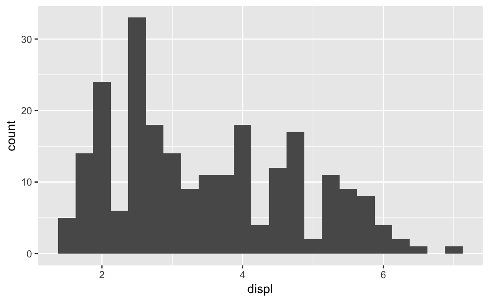


```r
ggplot(aes(x = displ, y = hwy), data = mpg) +
  geom_area()
```


### Exercise
2. Run this code in your head and predict what the output will look like. Then run the code in R and check your predictions:

```r
ggplot(
  data = mpg,
  aes(x = displ, y = hwy, color = drv)
) +
  geom_point() +
  geom_smooth(se = FALSE)
#> `geom_smooth()` using method = 'loess' and formula 'y ~ x'
```

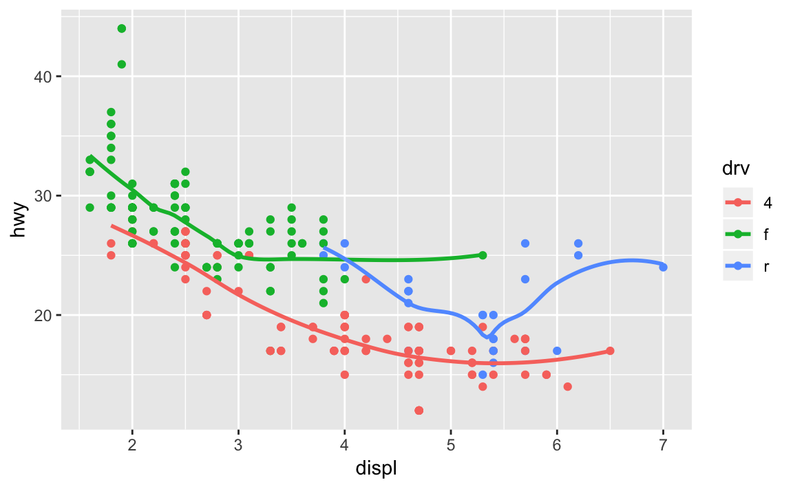

### Exercise
3. What does `show.legend = FALSE` do? What happens if you remove it? Why do you think I used it earlier in the chapter? It removes the legend. `show.legend` was used earlier because three visualizations were plotted together, so the legend would not have applied to all three. Or three legends would have looked messy.

```r
ggplot(
  data = mpg,
  aes(x = displ, y = hwy, color = drv)
) +
  geom_point(show.legend = FALSE) +
  geom_smooth(show.legend = FALSE)
#> `geom_smooth()` using method = 'loess' and formula 'y ~ x'
```

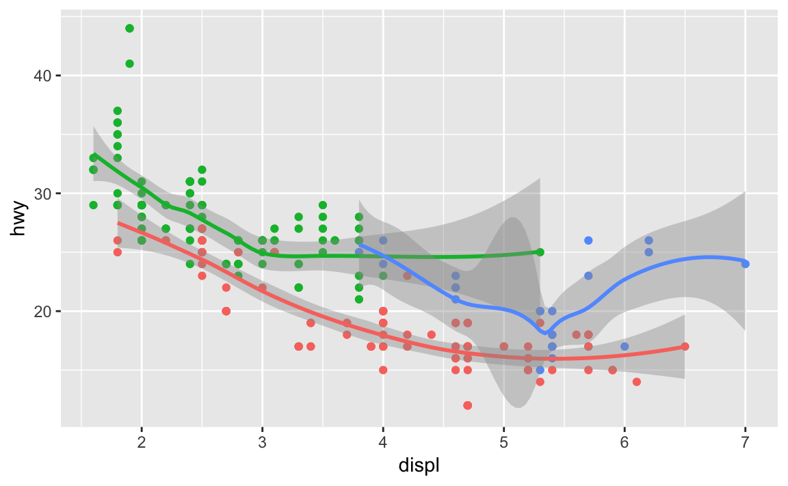

### Exercise
4. What does `se` argument for `geom_smooth()` do? It controls the display of the confidence interval. It's `TRUE` by default.

### Exercise
5. Will these two graphs look different? Why/why not? Yes. They have the same data and aesthetic. The first syntax is defined globally. The second is defined locally. Same arguments and data though.

```r

plot_1.4.5.2 <- ggplot(data = mpg, aes(x = displ, y = hwy)) +
  geom_point() +
  geom_smooth()

plot_1.4.5.1 <- ggplot() +
  geom_point(
    data = mpg,
    aes(x = displ, y = hwy)
  ) +
  geom_smooth(
    data = mpg,
    aes(x = displ, y = hwy)
  )

grid.arrange(plot_1.4.5.1, plot_1.4.5.2, nrow = 1)
#> `geom_smooth()` using method = 'loess' and formula 'y ~ x'
#> `geom_smooth()` using method = 'loess' and formula 'y ~ x'
```


### Exercise
6. Re-create the R code necessary to generate the following graphs.

```r
plot_1.4.6.1.1 <- ggplot(aes(x = displ, y = hwy), data = mpg) +
  geom_point() +
  geom_smooth(se = FALSE)

plot_1.4.6.1.2 <-ggplot(aes(x = displ, y = hwy), data = mpg) +
  geom_point() +
  geom_smooth(aes(group = drv), se = FALSE)

grid.arrange(plot_1.4.6.1.1, plot_1.4.6.1.2, nrow = 1)
#> `geom_smooth()` using method = 'loess' and formula 'y ~ x'
#> `geom_smooth()` using method = 'loess' and formula 'y ~ x'
```


```r
plot_1.4.6.2.1 <- ggplot(aes(x = displ, y = hwy, color = drv), data = mpg) +
  geom_point() +
  geom_smooth(se = FALSE)

plot_1.4.6.2.2 <-ggplot(aes(x = displ, y = hwy), data = mpg) +
  geom_point(aes(color = drv)) +
  geom_smooth(se = FALSE)

grid.arrange(plot_1.4.6.2.1, plot_1.4.6.2.2, nrow = 1)
#> `geom_smooth()` using method = 'loess' and formula 'y ~ x'
#> `geom_smooth()` using method = 'loess' and formula 'y ~ x'
```


```r
plot_1.4.6.3.1 <- ggplot(aes(x = displ, y = hwy, color = drv), data = mpg) +
  geom_point() +
  geom_smooth(aes(linetype = drv), se = FALSE)

plot_1.4.6.3.2 <-ggplot(aes(x = displ, y = hwy), data = mpg) +
  geom_point(aes(color = drv))

grid.arrange(plot_1.4.6.3.1, plot_1.4.6.3.2, nrow = 1)
#> `geom_smooth()` using method = 'loess' and formula 'y ~ x'
```

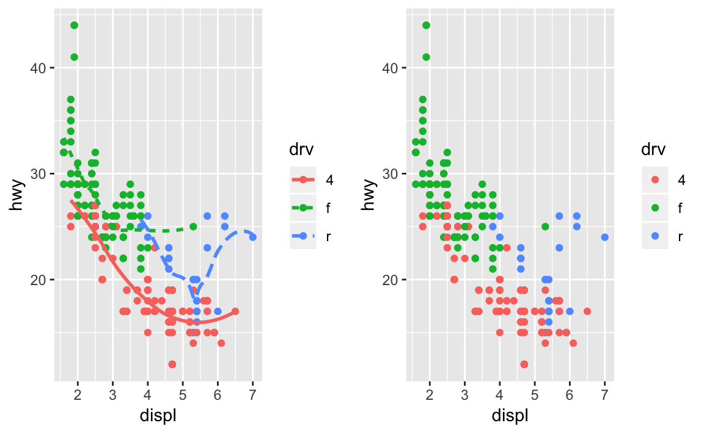

## Statistical transformation
### Exercise
1. What is the default geom associated with `stat_summary()`? How could you rewrite the previous plot to use that geom function instead of the stat function? The default is geom_point range.

```r
ggplot(data = diamonds) +
  geom_pointrange(
    aes(x = cut, y = depth),
    stat = 'summary',
    fun.ymin = min,
    fun.ymax = max,
    fun.y = median
    )
```


### Exercise
2. What does `geom_col()` do? How is it different to geom_bar()? The geom_col function uses stat_identity by default, which basically means it uses the data available provided by `y =`. Conversely, geom_bar uses stat_count, transforming the data and plotting the frequency (or proportion, if designated) of the x variable.

3. Most geoms and stats come in pairs that are almost always used in concert. Read through the documentation and make a list of all the pairs. What do they have in common? Check [ggplot2 documentation](http://ggplot2.tidyverse.org/reference/)

4. What variables does `stat_smooth()` compute? What parameters control its behavior?

  * y: predicted value

  * ymin: lower pointwise confidence interval around the mean

  * ymax: upper pointwise confidence interval around the mean

  * se: standard error

### Exercise
5. In our proportion bar chart, we need to set group = 1. Why? In other words, what is the problem with these two graphs? Without the group designation, geom_bar calculates the proportion relative to x, rather than all the variables combined. That's why each graph below displays 100%.

```r
ggplot(data = diamonds) + 
  geom_bar(aes(x = cut, y = ..prop..))
ggplot(data = diamonds) + 
  geom_bar(
    aes(x = cut, fill = color, y = ..prop..)
  )
```


## Position adjustments
### Exercise
1. What is the problem with this plot? How could you improve it? The values look discrete when continuous variables are being displayed. We can add some noise and reduce the alpha to make it more visually appealing as a scatter-plot. 

```r
ggplot(data = mpg, aes(x = cty, y = hwy)) +
  geom_point()

ggplot(data = mpg, aes(x = cty, y = hwy)) +
  geom_point(position = 'jitter', alpha = 1/2)
```

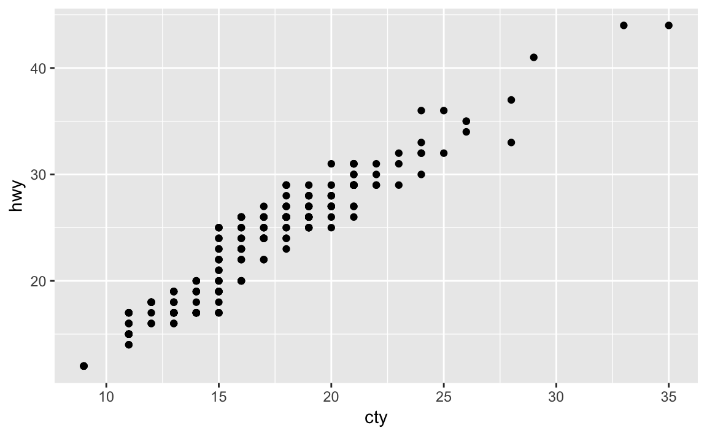

### Exercise
2. What parameters to `geom_jitter()` control the amount of jittering? Width and Height. Width controls the amount of vertical and horizontal jitter in both positive and negative directions. 

```r
ggplot(mpg, aes(cyl, hwy)) + geom_jitter()
ggplot(mpg, aes(cyl, hwy)) + geom_jitter(width = 0.25)
ggplot(mpg, aes(cty, hwy)) + geom_jitter()
ggplot(mpg, aes(cty, hwy)) + geom_jitter(width = 0.5, height = 0.5)
```


### Exercise
3. Compare and contrast `geom_jitter()` with `geom_count()`. `geom-jitter` adds noise to points to remove discreteness. `geom_count` counts the number of observations at each location, and then maps the count to the point area. In other words, it stacks any overplotting on itself and provisions it by size.

### Exercise
4. What's the default position adjustment for `geom_boxplot`? Create a visualization of the mpg data set that demonstrates it. `position = 'dodge'` is the default position.

```r
ggplot(data = mpg) +
  geom_boxplot(aes(x = drv, y = hwy, color = manufacturer))
```


## Coordinate systems
### Exercise
1. Turn a stacked bar chart into a pie chart using `coord_polar()`. 

```r
ggplot(data = diamonds) +
  geom_bar(aes(x = clarity, fill = cut)) +
  coord_polar()
```


### Exercise
2. What does `labs()` do? Read the documentation. The `labs()` function controls numerous text aesthetics of visualizations, including title, subtitle, caption, x axis label, and y axis label. Examples below from the [documentation](https://www.rdocumentation.org/packages/ggplot2/versions/2.2.1/topics/labs). 

```r
p <- ggplot(mtcars, aes(mpg, wt, colour = cyl)) + geom_point()
p + labs(colour = "Cylinders")
p + labs(x = "New x label")

# The plot title appears at the top-left, with the subtitle
# display in smaller text underneath it
p + labs(title = "New plot title")
p + labs(title = "New plot title", subtitle = "A subtitle")

# The caption appears in the bottom-right, and is often used for
# sources, notes or copyright
p + labs(caption = "(based on data from ...)")
```

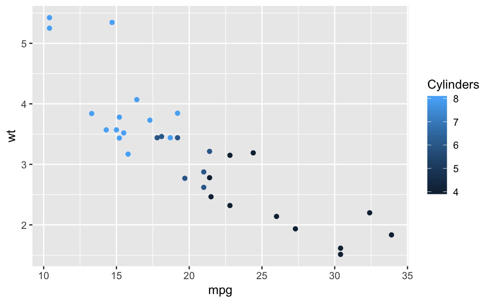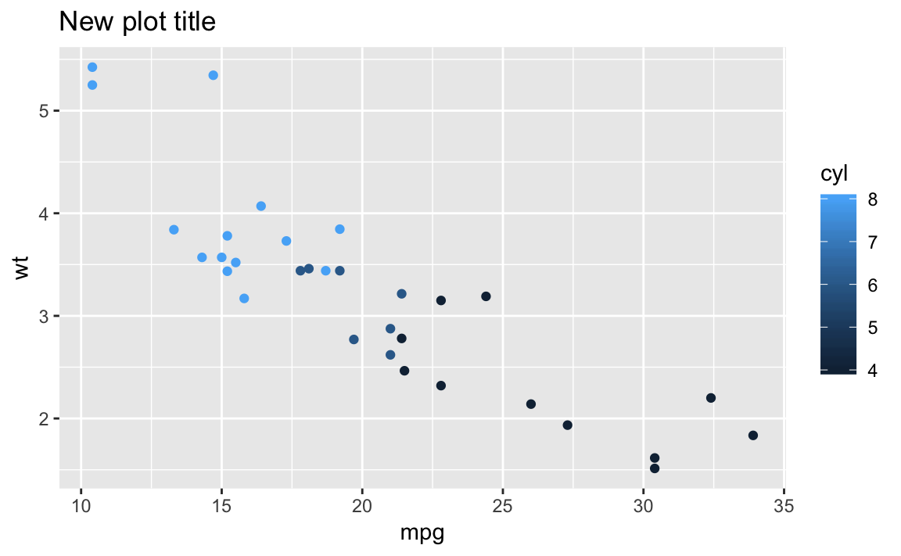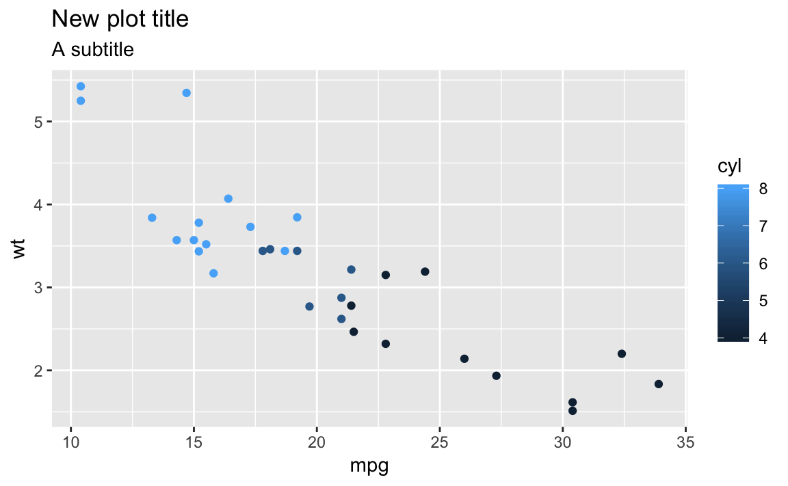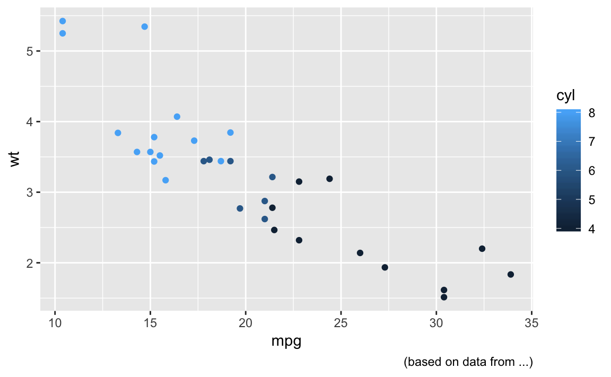

### Exercise
3. What is the difference between `coord_quickmap()` and `coord_map`? `coord_quickmap()` preserves straight lines with a quick approximation, and fixes aspect ratio. `coord_map` can be used to include map projects. See below from the [documentation](http://ggplot2.tidyverse.org/reference/coord_map.html).

```r
nz <- map_data("nz")
# Prepare a map of NZ
nzmap <- ggplot(nz, aes(x = long, y = lat, group = group)) +
  geom_polygon(fill = "white", colour = "black")

# Plot it in cartesian coordinates
nzmap
# With correct mercator projection
nzmap + coord_map()
# With the aspect ratio approximation
nzmap + coord_quickmap()

# Other projections
nzmap + coord_map("cylindrical")
nzmap + coord_map("azequalarea", orientation = c(-36.92, 174.6, 0))
nzmap + coord_map("lambert", parameters = c(-37, -44))

states <- map_data("state")
usamap <- ggplot(states, aes(long, lat, group = group)) +
  geom_polygon(fill = "white", colour = "black")
```

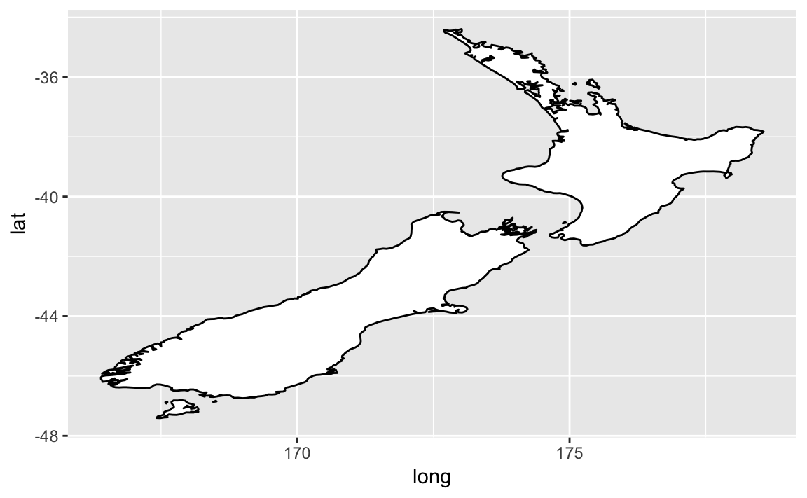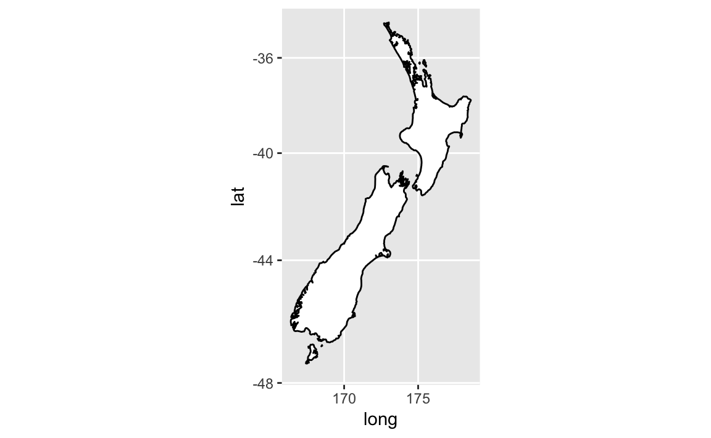

### Exercise
4. What does the following plot tell you about the relationship between city and highway mpg? Why is `coord_fixed()` important? What does `geom_abline()` do? The relationship is positive and looks pretty linear. `coord_fixed()` stipulates the aspect ratio to keep plots balanced. `geom_abline()` adds a reference line. 

```r
ggplot(data = mpg, aes(x = cty, y = hwy)) +
  geom_point() +
  geom_abline() +
  coord_fixed(ratio = 1)
```

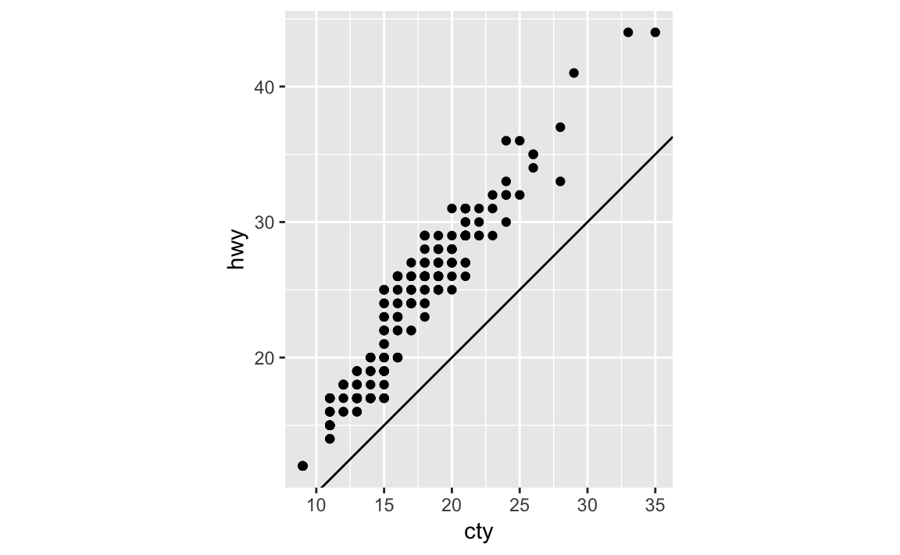


